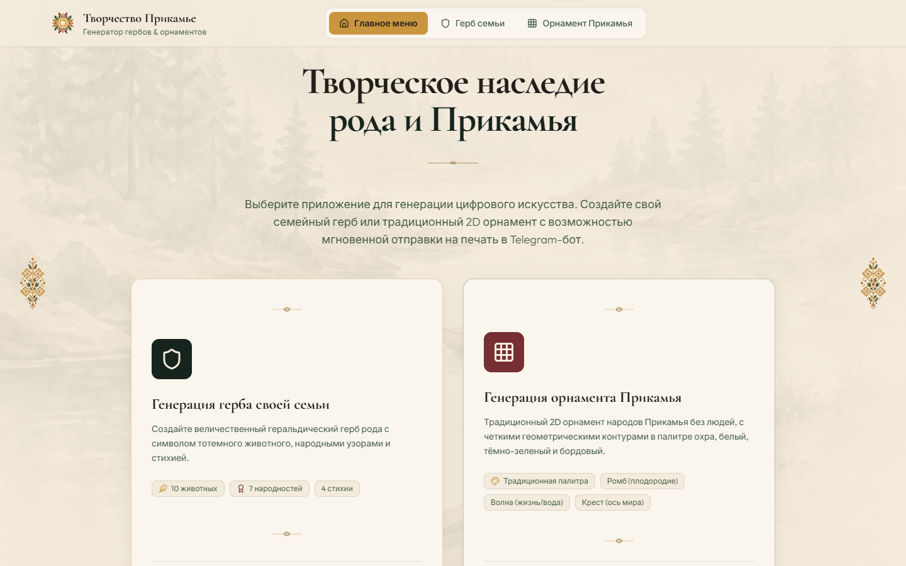
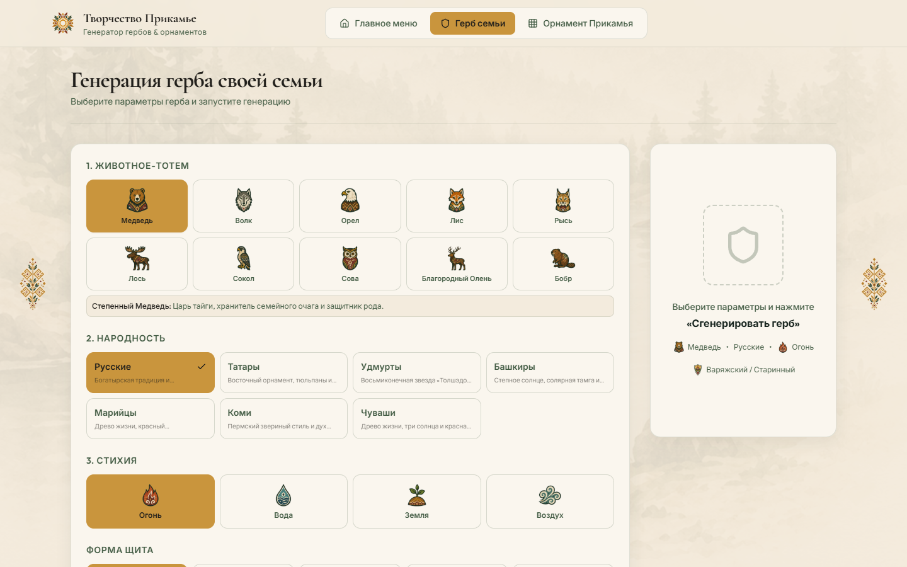
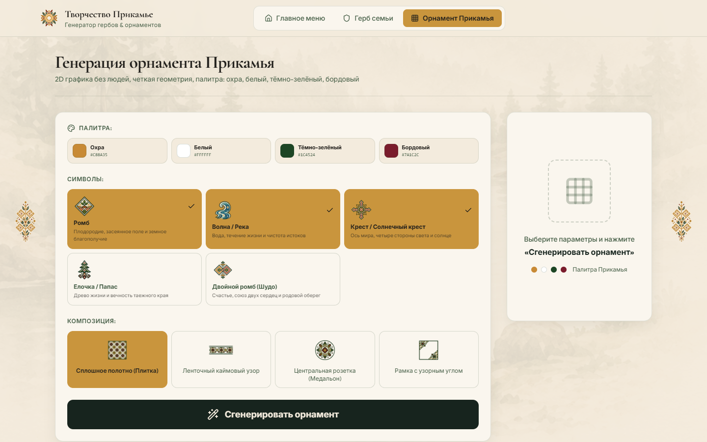

<p align="center">
  
</p>

# Творчество Прикамье

<p align="center">
  <a href="https://react.dev"></a>
  <a href="https://vite.dev"></a>
  <a href="https://tailwindcss.com"></a>
  <a href="https://vercel.com"></a>
  <a href="https://vitest.dev"></a>
  <a href="https://openrouter.ai"></a>
  <a href="https://github.com/sibds/GenCreativeImage"></a>
</p>

Веб-приложение для генерации семейных гербов и геометрических орнаментов Прикамья. Картинки рисует модель через OpenRouter; ключ живёт только на сервере.

Репозиторий: [sibds/GenCreativeImage](https://github.com/sibds/GenCreativeImage) · демо: [gencreativeimage.vercel.app](https://gencreativeimage.vercel.app)

© ООО «СибСР»

## Скриншоты

<p align="center">
  
</p>

| Герб семьи | Орнамент Прикамья |
|---|---|
|  |  |

## Что умеет

Два режима с общего лаунчера:

| | Герб семьи | Орнамент Прикамья |
|---|---|---|
| Холст | 3:4 | 1:1 |
| Параметры | тотем (10), народность (7), стихия (4), форма щита (5), девиз | символы (5, минимум 1), композиция (4) |
| Стиль | плоский этнографический folk, не европейская геральдика | плоский 2D-вектор, палитра охра / белый / тёмно-зелёный / бордовый |

После генерации: кнопка «Отправить на печать» шлёт макет в Telegram-группу и/или на email по серверному `.env`. Если каналы не заданы — скачать PNG / печать из браузера (см. [Печать](#печать)).

## Стек

- React 19 + Vite 8, Tailwind 4
- OpenRouter (`/images`, fallback на `/chat/completions`)
- Vercel Serverless (`api/generate.js`, `maxDuration: 300`; `api/dispatch.js`) + `@vercel/blob` для job-store в проде
- Vitest, Oxlint

## Как устроена генерация

Клиент **не** ходит в OpenRouter. Vite в деве кидает, если в бандл просочился `VITE_OPENROUTER_API_KEY`.

```
UI  →  POST /api/generate { prompt, mode: "crest"|"ornament" }
    ←  202 { jobId, status: "pending" }

UI  →  GET /api/generate?job=<uuid>   (poll ~2s, таймаут 4 мин)
    ←  pending | { success, imageUrl, prompt, source } | { error }
```

Сервер (`server/generate.js`):

1. Валидация: `prompt` ≤ 4000, `mode` ∈ `{crest, ornament}`.
2. Rate limit: 8 запросов / 10 мин на IP (loopback не режется).
3. Опционально прогоняет промпт через `OPENROUTER_TEXT_MODEL` (enhance, 12s timeout; при фейле остаётся сырой).
4. Основной вызов: `POST {endpoint}/images` — JPEG 1K, aspect по mode. Таймаут 270s.
5. Fallback на chat completions с `modalities: ["image","text"]`, если images отдал 400/404/405.

Job-store: in-memory локально, Vercel Blob на `VERCEL=1`. TTL записей 10 мин.

Локально тот же `/api/generate` поднимает Vite-плагин `server/vitePlugin.js` (и на `vite preview`).

## Быстрый старт

Нужен Node 20+.

```bash
npm install
copy .env.example .env   # Windows
npm run dev              # http://localhost:5173
```

В `.env` обязателен рабочий `OPENROUTER_API_KEY`. Без него API отвечает 503.

## Переменные окружения

Серверные OpenRouter/Blob — без `VITE_`. Префикс `VITE_` для ключа **запрещён** — Vite упадёт при старте. Киоск — `VITE_KIOSK_*` (не секреты).

| Переменная | Default | Зачем |
|---|---|---|
| `OPENROUTER_API_KEY` | — | ключ OpenRouter |
| `OPENROUTER_IMAGE_MODEL` | `google/gemini-3-pro-image` | модель картинки |
| `OPENROUTER_TEXT_MODEL` | пусто = skip enhance | LLM для доработки промпта |
| `OPENROUTER_ENDPOINT` | `https://openrouter.ai/api/v1` | база API |
| `BLOB_STORE_ID` | — | store id Vercel Blob (прод) |
| `BLOB_READ_WRITE_TOKEN` | — | токен Blob, если не из Vercel env |
| `VITE_KIOSK_CONTROLS` | `0` | кнопки «Киоск» / «Обычный режим»; по умолчанию скрыты |
| `VITE_KIOSK` | `0` | стартовать сразу в киоске |
| `VITE_KIOSK_IDLE_MS` | `600000` | видимый отсчёт «Сброс через …» после успешной генерации (10 мин) |
| `VITE_KIOSK_COUNTDOWN_MS` | `30000` | с этой отметки кнопка «Сброс» подсвечивается бордовым |
| `TELEGRAM_BOT_TOKEN` | — | токен бота для `sendPhoto` в группу |
| `TELEGRAM_CHAT_ID` | — | `-100…` супергруппы или `@PublicGroup` |
| `SMTP_HOST` | — | SMTP-сервер |
| `SMTP_PORT` | `465` | 465/TLS на Vercel надёжнее, чем 587 |
| `SMTP_SECURE` | по порту | `1`/`true` — TLS; `0`/`false` — нет |
| `SMTP_USER` / `SMTP_PASS` | — | логин SMTP |
| `DISPATCH_EMAIL_FROM` | = `SMTP_USER` | From |
| `DISPATCH_EMAIL_TO` | — | ящик печати |

`VITE_KIOSK_*` попадают в клиентский бандл — это не секреты. После смены перезапусти Vite / пересобери.

На Vercel те же имена в Environment Variables. Функции: `api/generate.js` → `maxDuration` 300.

### Киоск

Полноэкранный режим под Chrome `--kiosk`: без навбара и футера, контент вписывается в экран, из приложения **нельзя** вернуться на лаунчер.

| Переменная | Default | Поведение |
|---|---|---|
| `VITE_KIOSK_CONTROLS` | `0` | `1` — в Navbar кнопка «Киоск», в шапке киоска «Обычный режим». Иначе кнопок входа/выхода нет |
| `VITE_KIOSK` | `0` | `1` — открыть сразу в киоске (киоск-ПК). Иначе обычный UI |
| `VITE_KIOSK_IDLE_MS` | `600000` | после успешной генерации под картинкой сразу идёт отсчёт (10 мин). Любой клик/тач перезапускает. `0` на таймере — сброс **состояния текущего приложения** (форма и картинка), URL и экран не меняются |
| `VITE_KIOSK_COUNTDOWN_MS` | `30000` | когда осталось ≤ 30 с, кнопка «Сброс» становится бордовой |

Вход без кнопок: `?kiosk=1` в URL бьёт `VITE_KIOSK`. Ярлык Chrome:

```bash
chrome.exe --kiosk --app=http://localhost:5173/?kiosk=1
```

## Скрипты

```bash
npm run dev       # Vite + локальный /api/generate и /api/dispatch
npm run build
npm run preview   # прод-сборка + тот же API-плагин
npm test          # vitest run
npm run lint      # oxlint
```

Переснять скрины README (нужны Chrome и `playwright-core`, дев-сервер на `:5173`):

```bash
npm i -D playwright-core
node scripts/capture-screenshots.mjs
```

## Промпты

Собираются на клиенте, enhance (если задан text-model) — на сервере.

**Герб** — `src/data/crestData.js` → `buildOpenRoadCrestPrompt`

- Животные: медведь, волк, орёл, лис, рысь, лось, сокол, сова, олень, бобр
- Народности: русские, татары, удмурты, башкиры, марийцы, коми, чуваши
- Стихии: огонь, вода, земля, воздух
- Щиты: варяжский, прямоугольный, славянский, каплевидный, круглый тарч

**Орнамент** — `src/data/ornamentData.js` → `buildOpenRoadOrnamentPrompt`

Порядок блоков (композиция **раньше** символов и стиля):

1. `COMPOSITION TYPE`
2. Пространственная геометрия холста
3. Выбранные символы + иерархия
4. Стиль Прикамья + палитра
5. Visual style + Avoid + негатив конкретной композиции

| Композиция | Холст | Пустое |
|---|---|---|
| Плитка (`tile`) | 95–100%, бесшовный раппорт | нет |
| Лента (`border`) | полоса 20–30% высоты | много сверху/снизу |
| Медальон (`medallion`) | 60–70% | ≥15% вокруг |
| Рамка (`frame`) | 15–25% по краям | 65–75% центра пусто |

Символы: ромб, волна/река, солнечный крест, елочка/папас, двойной ромб (шудо).

Спека по композициям: [`docs/Требования к промптам для композиций орнамента.md`](docs/Требования%20к%20промптам%20для%20композиций%20орнамента.md)

## API

`POST /api/generate`

```json
{ "prompt": "...", "mode": "crest" }
```

`202`:

```json
{ "jobId": "uuid", "status": "pending" }
```

`GET /api/generate?job=<uuid>`

- `200 { "status": "pending" }`
- `200 { "success": true, "imageUrl": "...", "prompt": "...", "source": "OpenRouter — …", "message": "…" }`
- `200 { "success": false, "error": "…" }`
- `400` кривой job id, `404` нет задачи

Ошибки старта: `400` (нет/длинный prompt, плохой mode), `429`, `503` (нет ключа), `504` (таймаут модели).

`GET /api/dispatch` → `{ "telegram": true|false, "email": true|false }` (без секретов).

`POST /api/dispatch`

```json
{ "imageUrl": "data:image/jpeg;base64,...", "title": "Семейный герб", "metadata": "…" }
```

- `200 { "success": true, "telegram": { "ok": true }, "email": { "ok": true } }` — каналы, которые включены в env
- `200` с `success: true` и `email.ok: false`, если SMTP упал, а Telegram прошёл (и наоборот)
- `400` нет/кривой `imageUrl`
- `429` rate limit
- `502` все включённые каналы упали
- `503 { "error": "no_channels" }` — в env нет ни Telegram, ни SMTP

## Печать

Кнопка «Отправить на печать» (карточка результата и Navbar).

- Если в `.env` задан Telegram (`TELEGRAM_BOT_TOKEN` + `TELEGRAM_CHAT_ID`) и/или SMTP (`SMTP_HOST` + `DISPATCH_EMAIL_TO` + from/user) — модалки нет, сразу `POST /api/dispatch`. Оба канала — оба параллельно.
- Если каналов нет — модалка только со скачиванием PNG и `window.print()`.
- Токен бота и SMTP живут только на сервере. Имя группы в Telegram — это `chat.id` (`-100…`), не отображаемое название.

Как снять `TELEGRAM_CHAT_ID`: добавить бота в группу (право слать фото) → любое сообщение в группе → `GET https://api.telegram.org/bot<TOKEN>/getUpdates` → `chat.id`. Для публичной группы можно `@username`.

На Vercel для SMTP бери порт **465** (TLS). 587 STARTTLS в serverless часто отваливается. С домашней сети провайдеры часто режут исходящие 25/465 — тогда локально `SMTP_PORT=587` + `SMTP_SECURE=0`. `$` в `SMTP_PASS` Vite больше не разворачивает.

## Структура

```
api/generate.js              Vercel handler (waitUntil + poll)
api/dispatch.js              печать: GET флаги каналов, POST Telegram/SMTP
server/generate.js           OpenRouter, rate limit, enhance
server/dispatch.js           sendPhoto + nodemailer, allSettled
server/jobs.js               UUID-джобы
server/jobStore.js           memory | Vercel Blob
server/vitePlugin.js         /api/generate и /api/dispatch в dev/preview
src/data/crestData.js
src/data/ornamentData.js
src/services/openRoadService.js   POST + poll
src/services/dispatchService.js   GET config + POST печати
src/kiosk/config.js              VITE_KIOSK_* + ?kiosk=1
src/components/{crest,ornament,print,settings,kiosk}/
docs/                        требования к промптам орнамента
```

## Тесты

```
server/generate.test.js
server/dispatch.test.js
server/jobs.test.js
server/jobStore.test.js
src/data/ornamentData.test.js
src/services/openRoadService.test.js
src/kiosk/config.test.js
src/kiosk/useKioskIdle.test.js
```

OpenRouter в тестах мокается; ключ не нужен.
