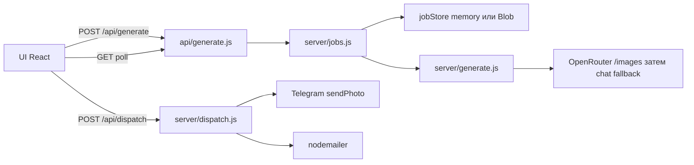

# Архитектура

React 19 + Vite 8 + Tailwind 4. Картинки рисует модель через OpenRouter. Клиент **не** ходит в OpenRouter: ключ только на сервере (`OPENROUTER_API_KEY`). Префикс `VITE_` для ключа запрещён — Vite падает при старте, если задан `VITE_OPENROUTER_API_KEY`.

Прод: Vercel Serverless (`api/generate.js`, `maxDuration: 300`; `api/dispatch.js`) + `@vercel/blob` для job-store. Локально те же маршруты поднимает Vite-плагин [`server/vitePlugin.js`](../server/vitePlugin.js) (и на `vite preview`).

## Поток



1. UI собирает промпт на клиенте (`buildOpenRoadCrestPrompt` / `buildOpenRoadOrnamentPrompt`).
2. [`src/services/openRoadService.js`](../src/services/openRoadService.js) делает `POST /api/generate { prompt, mode }`.
3. Сервер сразу отвечает `202 { jobId, status: "pending" }` и гоняет генерацию в фоне.
4. Клиент поллит `GET /api/generate?job=<uuid>` каждые ~2 с, таймаут 4 мин.
5. Печать: `GET /api/dispatch` за флагами каналов, затем либо `POST /api/dispatch`, либо модалка в браузере. См. [Печать](print.md).

На Vercel POST использует `waitUntil(runGenerateJob(...))`, чтобы работа продолжилась после 202. Локально `void runGenerateJob(...)` в том же процессе.

## Генерация на сервере

[`server/generate.js`](../server/generate.js) → `handleGenerate`:

1. Валидация: `prompt` обязателен, ≤ 4000 символов; `mode` ∈ `{crest, ornament}` (по умолчанию `crest`).
2. `apiKey` / `endpoint` / `imageModel` из тела запроса **игнорируются** — только env.
3. Rate limit: 8 запросов / 10 мин на IP. Loopback (`127.0.0.1`, `::1`, `local`) не режется.
4. Нет ключа или плейсхолдер `your_openrouter_api_key_here` → 503.
5. Опциональный enhance: если задан `OPENROUTER_TEXT_MODEL`, промпт прогоняется через chat completions (12 с). При любой ошибке остаётся сырой промпт.
6. Основной вызов: `POST {endpoint}/images` — JPEG 1K, aspect `3:4` (crest) или `1:1` (ornament). Таймаут 270 с.
7. Fallback на `POST {endpoint}/chat/completions` с `modalities: ["image","text"]`, если images отдал 400/404/405 или сеть упала.

Успех: `{ success: true, imageUrl, prompt, source: "OpenRouter — {model}", message }`. Таймаут модели → 504.

## Job-store

[`server/jobStore.js`](../server/jobStore.js):

| Среда | Бэкенд | TTL |
|---|---|---|
| локально (нет `VERCEL`) | in-memory `Map` | 10 мин, sweep на get/set |
| `VERCEL=1` | Vercel Blob `jobs/{uuid}.json` | `cacheControlMaxAge: 60` |

Job id — UUID. Кривой id → 400, нет задачи → 404.

## Секреты в Vite

[`server/envSecrets.js`](../server/envSecrets.js) → `overlayUnexpandedSecrets`: Vite `loadEnv` гоняет dotenv-expand и съедает `$` в паролях (например `SMTP_PASS`). Плагин перечитывает `.env` через `parseEnv` без expand и перекрывает ключи OpenRouter / Telegram / SMTP.

## Структура

```
api/generate.js              Vercel handler (waitUntil + poll)
api/dispatch.js              печать: GET флаги каналов, POST Telegram/SMTP
server/generate.js           OpenRouter, rate limit, enhance
server/dispatch.js           sendPhoto + nodemailer, allSettled
server/jobs.js               UUID-джобы
server/jobStore.js           memory | Vercel Blob
server/vitePlugin.js         /api/generate и /api/dispatch в dev/preview
server/envSecrets.js         литеральный $ в секретах
src/data/crestData.js
src/data/ornamentData.js
src/services/openRoadService.js   POST + poll
src/services/dispatchService.js   GET config + POST печати
src/kiosk/config.js              VITE_KIOSK_* + ?kiosk=1
src/components/{crest,ornament,print,settings,kiosk}/
```
